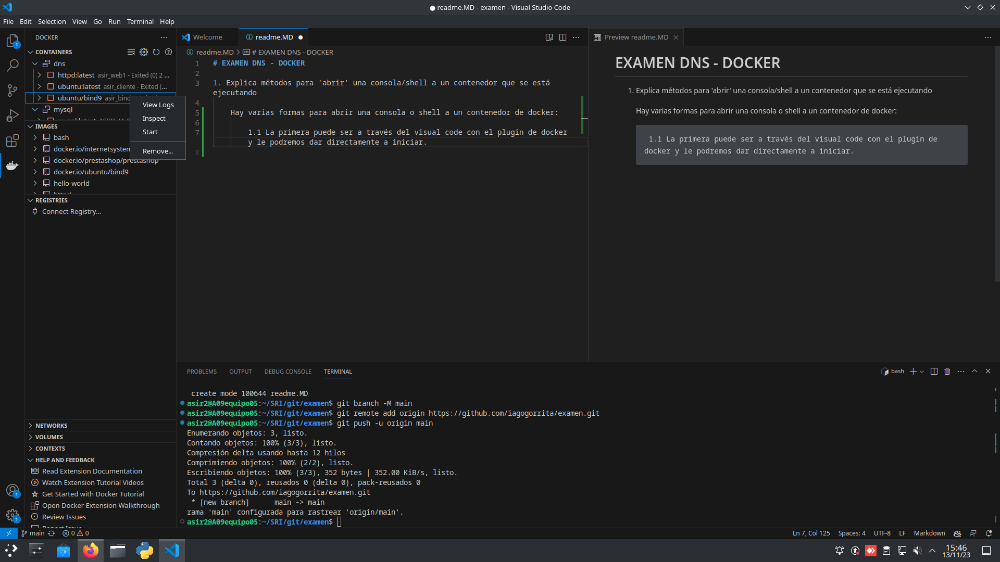

# EXAMEN DNS - DOCKER

1. Explica métodos para 'abrir' una consola/shell a un contenedor que se está ejecutando

    Hay varias formas para abrir una consola o shell a un contenedor de docker:
    
    1.1. La primera puede ser a través del visual code con el plugin de docker y le podremos dar directamente a iniciar, dandole click derecho y start.
        
    1.2. La segunda forma será con el comando **`docker exec -it *nombredelcontenedor* bash `**
2. En el contenedor anterior con que opciones tiene que haber sido arrancado para poder interactuar con las entradas y salidas del contenedor.

    Tiene que haber sido arrancado con stdin_open: true que mantiene la entrada estandar abierta lo que permite que el usuario interactue y tty: true que habilita un terminal simulado que nos permitira interactuar dentro del contenedor, estas son las opciones que nos permitiran interactuar con el contentedor.
3. ¿Cómo sería un fichero docker-compose para que dos contenedores se comuniquen entre si en una red solo de ellos?

    Para que dos contenedores interactuen entre si, unicamente tendremos que hacer que esten en la misma red levantando una red para que esten los dos solos y se puedan comunicar entre si. Para ello dejo la red de mi docker compose aquí:
```
networks: #nombre de nuestra red
  network: #nombre de la subred
    ipam: #el protocolo que utiliza podria ser bridge tambien
      config: 
        - subnet: 172.28.0.0/24 #la subred que utilizará
          gateway: 172.28.0.1 #el gateway de nuestra subred
```
Además obviamente tendremos que tener los dos servicios en la misma subred para que se puedan comunicar.

4. ¿Qué hay que añadir al fichero anterior para que un contenedor tenga la IP fija?

    Tendremos que ponerle a cada uno de los servicios, un network y en el tendremos que poner una ip en nuestro caso IPV4, dejo el codigo aquí:

    ```
    -Servicio de ubuntu
    ubuntu:
    container_name: asir_cliente
    #nombre del equipo de nuestro cliente
    image: ubuntu:latest
    #instalaremos la ultima imagen de ubuntu poniendole el latest
    networks:
      network: 
        ipv4_address: 172.28.0.70
        #la ip será 172.28.0.70
    -Servicio de httpd
    web1:
    container_name: asir_web1
    image: httpd:latest
    networks:
      network:
        ipv4_address: 172.28.0.80
    ```
5. ¿Que comando de consola puedo usar para saber las ips de los contenedores anteriores? Filtra todo lo que puedas la salida.
    
El comando es el siguiente:

    docker inspect -f '{{range .NetworkSettings.Networks}}{{.IPAddress}}{{end}}' nombre_del_contenedor

Si cambio el nombre_del_contenedor por asir_bind9 que es como se llama mi contenedor con el servicio dns me dirá la IP que tiene asignada este.

    docker inspect -f '{{.Name}} - {{range .NetworkSettings.Networks}}{{.IPAddress}}{{end}}' $(docker ps -q)

Con este por ejemplo nos dira las ips de todos los contenedores en ejecución, con su nombre antes.

6. ¿Cual es la funcionalidad del apartado "ports" en docker compose?

El apartado ports de docker compose nos permite especificar los puertos que necesitemos exponer para nuestros servicios del docker compose. La exposición de puertos es fundamental para permitir que los servicios dentro de contenedores se comuniquen entre sí o con el mundo exterior.

Por ejemplo este apartado port de mi docker compose:
```
    ports:
     - '58080:80'
```
Esto hace que se exponga el puerto 58080 de nuestro contenedor al puerto 80 del host.

7. ¿Para que sirve el registro CNAME? Pon un ejemplo

El registro CNAME (Canonical Name) en DNS (Domain Name System) se utiliza para crear un alias o un apodo de un dominio. Esto permite que un nombre de un dominio, pueda asociarse con otro dominio.

Supongamos que tienes un sitio web llamado "mi-sitio-web.com" y también tienes un servidor de correo llamado "correo.miservidor.com". Puedes crear un registro CNAME para asociar el nombre "correo.miservidor.com" con "mi-sitio-web.com". Esto sería útil si, por ejemplo, decides cambiar la dirección IP de tu servidor de correo en el futuro; solo necesitarías actualizar el registro CNAME en lugar de cambiar múltiples registros A (direcciones IP) asociados al dominio.

8. ¿Como puedo hacer para que la configuración de un contenedor DNS no se borre si creo otro contenedor?

Podrias guardar la configuración del DNS en un volumen, y lo vincularas con el docker compose, cuando lo hagas aunque borres o crees otro DNS, este siempre se creara igual con el docker compose haciendo que sea muy facil de manejar los archivos desde fuera del contenedor, y además tendremos la certeza de que siempre será la misma configuración salvo que la cambies.

9. Añade una zona tiendadeelectronica.int en tu docker DNS que tenga:

    - www a la IP 172.16.0.1
    
    - owncloud sea un CNAME de www
    
    - un registro de texto con el contenido "1234ASDF"
    
    - Comprueba que todo funciona con el comando "dig"
    - Muestra en los logs que el servicio arranca correctamente
    
    
